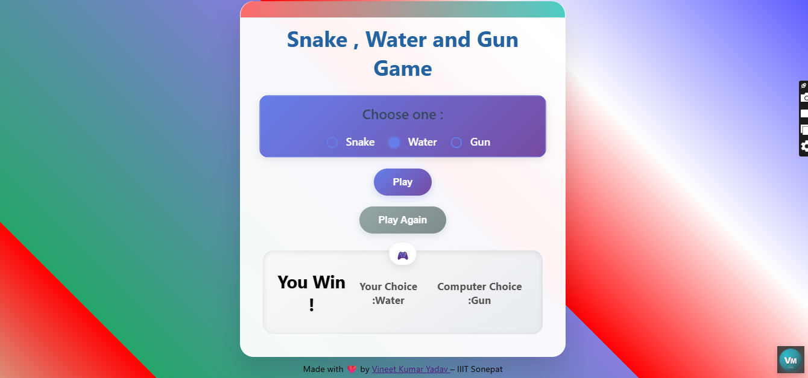

# 🐍 Snake, Water, and Gun Game 🎮

A fun and interactive browser-based game where the player competes against the computer using the classic "Snake, Water, Gun" logic — similar to Rock, Paper, Scissors!

👉 [Play Live Here](https://vineet112111.github.io/Snake-Water-Gun-Game/)  
📁 [View Repository](https://github.com/Vineet112111/Snake-Water-Gun-Game)

---

## 📸 Screenshot

 

---

## 🕹️ How to Play

- Select one option: **Snake**, **Water**, or **Gun**
- Click on **Play** to make your move
- The computer randomly selects one of the options
- Result is shown: Win, Lose, or Draw!

---

## 🛠️ Tech Stack

- ✅ HTML
- ✅ CSS (Fully Responsive + Animated UI)
- ✅ JavaScript (DOM Manipulation + Game Logic)

---

## ✨ Features

- Beautiful animated UI 🎨  
- Random computer logic using JavaScript 🔄  
- Custom styling for selected radio buttons 🎯  
- Reset game anytime 🧹  
- Works perfectly on mobile & desktop 📱💻

---

## 💡 My Experience

While working on the background animation and style effects in the CSS file, I ended up experimenting with `background-size`, `background-position`, and gradients for hours. Without realizing, 2 hours had flown by! 😄 But it turned out super exciting, and I'm proud of how the final look came together!

---

## 🙋‍♂️ Author

Made with ❤️ by  
**[Vineet Kumar Yadav](https://www.linkedin.com/in/vineet-yadav-68059533a/)**  
👨‍🎓 IIIT Sonepat  
🚀 Frontend & JS Enthusiast

---

## 📂 Project Structure

📁 Snake-Water-Gun-Game/
├── index.html # Main HTML file
├── style.css # All styles & animations
├── script.js # Game logic
├── VineetLogo.png # Title icon
└── screenshot.png # Game screenshot 
